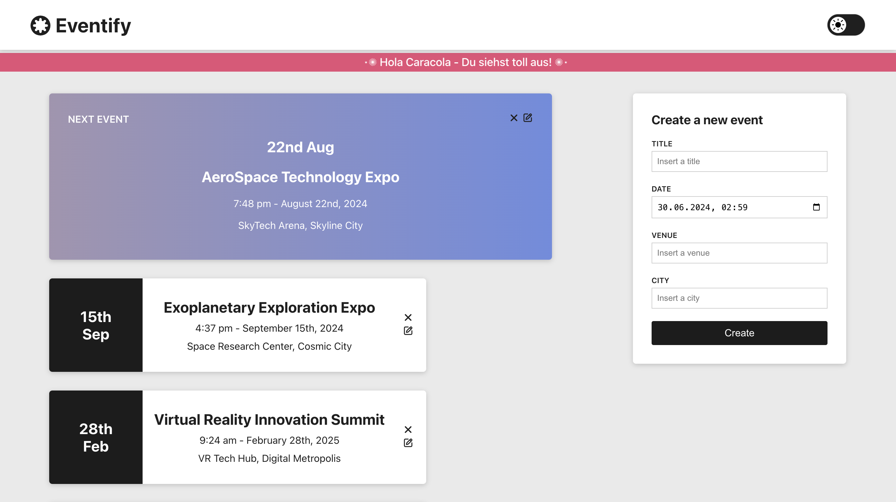
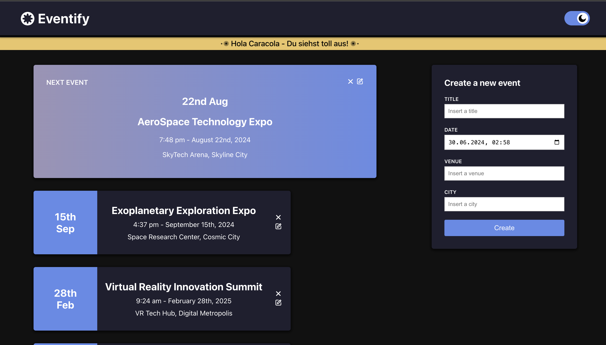

# ✨Eventify

Eventify is a comprehensive full-stack application designed to manage events effortlessly. This repository provides functionalities to track, publish, edit, and delete upcoming events seamlessly. Built with a user-friendly interface and robust backend, Eventify ensures smooth event management from creation to updates and removal, making it an ideal solution for event organizers and planners.

### Light & Dark Theme:

# ✨Tech Stack

### BACKEND

### FRONTEND

 

### DATABASE

